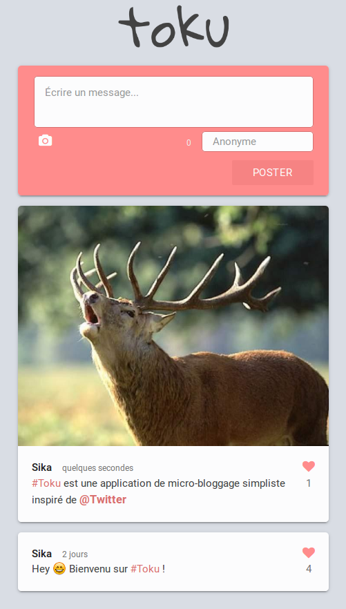

# Toku

**Toku** est une application de micro-bloggage simpliste inspiré par Twitter.

Elle est composée de deux parties:

- Une API REST qui gère la base de données (MongoDB)
- Un client léger utilisant [ReactJS](https://facebook.github.io/react/) et [Alt.js](http://alt.js.org/)



## Utilisation

Toku se veut simple et simpliste :

- Il n'y a aucune authentification. Chaque utilisateur est libre d'utiliser le nom qu'il veut.
- Le client n'a pas de dépendances externes. Ainsi, il peut être utilisé dans un réseau local non connecté à Internet.
- Le client est *responsive*. Il s'adapte à toute taille d'écran.
- Les postes sont des messages de 140 caractères maximum pouvant contenir une image.
- Chaque *poste* est parsé pour mettre en valeur les **#hashtag**, **@at** et **émoticones :-)**.
- Les postes peuvent être supprimés uniquement par ceux qui connaissent le mot de passe configuré sur l'API.

## Installation

### Avec Docker

Pour lancer l'application (client + API + MongoDB) facilement avec Docker, il suffit de lancer les commandes suivantes :

```sh
git clone https://github.com/5ika/Toku.git
cd Toku
docker-compose up -d
```

Une fois terminée, vous pouvez accéder au client avec l'url `http://localhost:8080`.

Pour aller plus loin, voir la documentation de [Docker](https://www.docker.com/) et de [docker-compose](https://docs.docker.com/compose/overview/).

### Sans Docker

Il est également possible de lancer chaque partie séparement.

#### L'API et la base de donnée

L'API permet de gérer les données et les stocker dans une base de données MongoDB.

Tout d'abord, modifiez la configuration dans `server/package.json` comme vous le souhaitez:

```
...
"config": {
    "port": 8080, // Port sur lequel écoute le serveur
    "delete_password": "random_password" // Mot de passe pour supprimer un poste
 }
...
```

Puis lancez les commandes suivantes :

```sh
cd client
yarn # ou `npm install`
node_modules/.bin/grunt build
cd ../server
yarn # ou `npm install`
export MONGODB_URL= mongo.example.com # FQDN de votre MongoDB (default = localhost)
node app
```

Vous pouvez ensuite accéder à l''interface web: `http://localhost:8080`.
